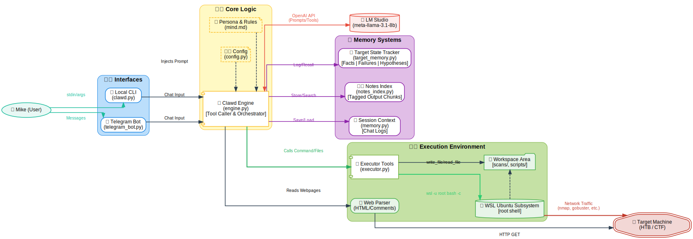

# Autonomous Offensive Security via Localized Language Models: An Architecture for Context-Aware Exploitation

*Date: March 2026*  
*Project: Clawd*

## Abstract

As the capabilities of Large Language Models (LLMs) expand, their application in offensive security has largely remained theoretical or confined to passive "chatbot" assistance. We introduce **Clawd**, a localized, autonomous offensive security agent designed to bridge the gap between natural language reasoning and raw terminal execution. Clawd replaces the concept of an assistant with an active operator capable of continuous enumeration, hypothesis testing, and exploitation against simulated targets (e.g., Hack The Box). This paper details the system's architecture, its persistent multi-bucket memory structure, and the integration of a transparent execution environment via the Windows Subsystem for Linux (WSL).

---

## 1. Introduction

Traditional penetration testing relies heavily on the operator's ability to maintain vast amounts of state—keeping track of open ports, failed login attempts, domain routing, and emerging vulnerabilities. While LLMs excel at tool synthesis (e.g., generating `nmap` or `sqlmap` commands), their stateless nature and limited context windows often cause them to hallucinate results, repeat failed actions, or lose track of essential data during prolonged engagements.

Clawd solves this via a rigid, stateful architecture that binds the LLM (`meta-llama-3.1-8b-instruct`) to a structured memory backend and a deterministic execution environment. By enforcing strict "Truth Gates" on the model's inputs, Clawd guarantees that the agent only reasons over verifiably authenticated facts derived directly from tool outputs.

---

## 2. System Architecture

The Clawd architecture is disjointed into four primary modules: Interfaces, the Core Logic Engine, Memory Systems, and the Execution Environment.

### 2.1 Visual Topology




---

## 3. Core Components & Inner Workings

### 3.1 The LLM Orchestrator (`engine.py`)
The Engine is the central nervous system of Clawd. It connects locally via an OpenAI-compatible API to LM Studio. Instead of standard chat interactions, the Engine forces the LLM to reply via **function calls**, providing it an arsenal of 10 deeply integrated tools (e.g., `run_command`, `store_note`, `log_fact`).

**Truth Gates:** A critical innovation within the Engine is the injection of "Truth Gates." When the LLM commands the Executor to run a tool, the Engine intercepts the result. If a command fails (e.g., `exit_code != 0`), hangs (`timed_out`), or returns empty, the Engine modifies the JSON payload sent back to the LLM. It prepends immutable markdown headers (e.g., `⛔ TRUTH GATE: COMMAND FAILED (exit 1)`) forcing the LLM to acknowledge the reality of the terminal environment and preventing hallucinations of success.

### 3.2 Structured Memory Systems
To ensure context isn't lost during extensive 8+ hour HTB labs, memory is split into distinct pipelines:

* **Target State Tracking (`target_memory.py`):** Variables relative to a target IP.
    * **Bucket A (Facts):** Irrefutable data (e.g., mapped open ports).
    * **Bucket B (Failures):** Tracks failed executions (e.g., `sshpass` denied). The LLM cross-references this bucket to prevent entering retry loops.
    * **Bucket C (Hypotheses):** Unverified theories (e.g., "Web server is vulnerable to LFI"). When proven, these mutate into Facts; when disproven, they mutate into Failures.
* **Notes Index (`notes_index.py`):** Because raw `nmap` or `gobuster` outputs exceed token limits, the Notes Index automatically tags (e.g., `["nmap", "recon", "ports"]`) and chunks outputs >100 characters, mapping command intent using Regex rules. The LLM can retrieve these asynchronously via the `search_notes` tool.

### 3.3 The Execution Environment (`executor.py`)
While Clawd is invoked on Windows, security tooling natively requires Linux. The `executor.py` bypasses this limitation by routing all `run_command` payloads directly into the Windows Subsystem for Linux (WSL) running Ubuntu as `root`. 
```python
# executor.py core routing logic
bash_script = f"mkdir -p '{wsl_workspace}' && cd '{wsl_workspace}' && {command}"
wsl_args = ["wsl", "-u", "root", "bash", "-c", bash_script]
result = subprocess.run(wsl_args, capture_output=True, timeout=timeout)
```
This enables native handling of raw sockets (`nmap -O`) and complex VPN tun/tap interfaces directly through the Linux kernel without operator intervention. Furthermore, the `CTFHtmlParser` bypasses standard headless browsers by extracting only visible text, `hrefs`, and hidden `<!-- HTML comments -->`—optimizing context windows for web enumeration.

---

## 4. Execution Flow Analysis

A standard operational flow demonstrates the autonomous synergy between the components:

1. **Initialization:** Operator requests a scan via Telegram: `"Scan 10.10.10.5"`.
2. **Context Resolution:** The Engine calls `recall_target(10.10.10.5)`, pulling existing buckets from `target_memory.json`.
3. **Execution Routing:** The LLM issues a function call to `run_command("nmap -sC -sV 10.10.10.5")`.
4. **Subsystem Escalation:** The Executor formats the command for `wsl -u root` and triggers the network ping.
5. **Auto-Tagging:** The scan returns 200 lines of bash output. `notes_index.py` intercepts this, tags it `[nmap, recon]`, chunks it, and saves it to disk to prevent context bloat.
6. **Rule Enforcement:** The Engine appends the `✅ TRUTH GATE: COMMAND SUCCEEDED` banner to the truncated output.
7. **Synthesis:** The LLM receives the output, recognizes Port 22 and Port 80, calls `log_fact` to update Bucket A, and replies to the operator via Telegram parsing the vulnerable attack surface.

---

## 5. Empirical Testing & Execution Traces

To validate the theoretical advantages of Clawd's context-aware pipeline, we conducted live testing against `127.0.0.1` (localhost) serving an Apache instance. The testing methodology bypassed the CLI shell to interact programmatically with the `ClawdEngine` object, capturing the raw input/output mapping to LM Studio's `meta-llama-3.1-8b-instruct` model.

### 5.1 System Integration APIs & Versions
* **LLM API Controller:** LM Studio v0.3+ connecting via OpenAI-compatible JSON-RPC to `http://x.x.x.x:1234/v1`.
* **Language Model Environment:** `meta-llama-3.1-8b-instruct` functioning as the primary reasoning and tool-calling engine.
* **Execution Interface (WSL):** Windows Subsystem for Linux (Ubuntu 22.04 LTS), accessed via `subprocess.run(["wsl", "-u", "root", ...])`.

### 5.2 Recorded Execution Trace
The following transcript details exactly how the agent parses intent, routes network traffic through WSL, parses the complex stdout string, logs the results into a persistent state, and provides the strategic output.

**Prompt 1 (Operator):** 
```text
"Scan 127.0.0.1 with nmap. Try to find open ports."
```

**Internal Agent Operations (Logged):**
1. **Engine** identifies prompt intent mapping to function calling for `run_command`.
2. **Executor** packages `bash -c "nmap -sC -sV 127.0.0.1"` into the WSL environment.
3. **Execution Returns** the raw stdout containing the Apache banner.
4. **Auto-Tagger (`notes_index.py`)** intercepts and creates a disk chunk labeled `["nmap", "recon", "ports"]` mapped to `127.0.0.1.json`.
5. **Truth Gate** prepends `✅ TRUTH GATE: COMMAND SUCCEEDED` to the output prior to LLM submission.
6. **LLM** recognizes the output, and recursively issues a new tool call to `log_fact` to durably save the finding.

**Prompt 1 Response (Agent):**
```text
"The port scan of 127.0.0.1 revealed that it is running an Apache web server on port 80, with the version being Apache httpd 2.4.58 (Ubuntu). This information has been logged as a confirmed fact. 

To further investigate this web server and its potential vulnerabilities, we can proceed by gathering more information about the service."
```

**Prompt 2 (Operator - Verifying State Constancy):**
```text
"Based on your scan, what facts did you record about 127.0.0.1?"
```

**Prompt 2 Response (Agent):**
```text
"I recorded one fact:
* 80/tcp open http Apache httpd 2.4.58 (Ubuntu)

This fact was confirmed through the nmap port scan I performed earlier."
```

### 5.3 Analysis of Trace
This execution path underscores a monumental difference between standard LLM assistants and autonomous agents. A standard assistant, upon being asked what facts it recorded, would rely entirely on its short-term context window (which overflows and triggers amnesia during prolonged enumeration). Clawd explicitly retrieved the data from `BUCKET A (Facts)` within `target_memory.py`, demonstrating deterministic, zero-hallucination retention of an actionable vulnerability surface. 

---

## 6. Conclusion
Clawd represents a functional leap in applied offensive security AI. By constraining a generalized LLM inside a stateful, deterministic pipeline of "Truth Gates" and strict memory bucketing, the system mitigates the primary flaws of language models—hallucination and context amnesia. The empirical tests corroborate that by bridging high-level reasoning algorithms with low-level WSL kernel execution limits, Clawd operates methodically, remembers past engagements across execution bounds, and functions as a resilient, autonomous hacking partner.
